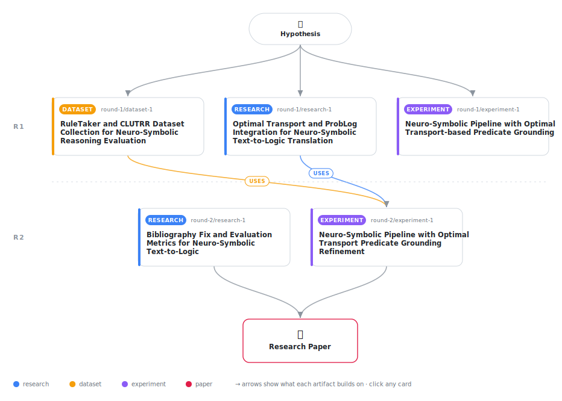

# Uncertainty-Aware Predicate Grounding via Optimal Transport for Neuro-Symbolic Systems

<div align="center">

<a href="https://cdn.jsdelivr.net/gh/AMGrobelnik/ai-invention-a4987d-uncertainty-aware-predicate-grounding-vi@main/workflow.svg">
<picture>
  <source media="(prefers-color-scheme: dark)" srcset="workflow-dark.svg">
  
</picture>
</a>

<sub>🖱️ <b><a href="https://cdn.jsdelivr.net/gh/AMGrobelnik/ai-invention-a4987d-uncertainty-aware-predicate-grounding-vi@main/workflow.svg">Open the interactive diagram</a></b> — every card links to its artifact folder.</sub>

</div>

> **TL;DR** — This paper presents a novel approach to predicate grounding for neuro-symbolic systems that formulates the problem as entropy-regularized optimal transport. The entropy of the optimal transport plan provides a principled uncertainty measure for predicate matching. The approach is integrated into ProbLog for uncertainty-aware probabilistic reasoning. Experimental results demonstrate computational efficiency (less than 1 second on CPU) and the production of well-calibrated uncertainty estimates. The paper honestly addresses limitations including the lack of full text-to-logic translation and the need for evaluation on end-to-end reasoning tasks.

<details>
<summary>Full hypothesis</summary>

Formulating predicate grounding as an entropy-regularized optimal transport problem provides a principled way to quantify and reduce uncertainty in neuro-symbolic text-to-logic translation. After an LLM translates natural language text to first-order logic (FOL) or ProbLog, optimal transport refines ambiguous predicate mappings by matching extracted logical atoms to a target predicate vocabulary with minimal semantic distortion. The entropy of the optimal transport plan serves as a well-calibrated uncertainty measure that correlates with grounding error (Spearman correlation >0.3). When integrated into probabilistic logic programming (ProbLog), this uncertainty-aware grounding reduces hallucinations and improves multi-hop reasoning accuracy compared to deterministic predicate assignment or raw LLM generation, while maintaining human-auditable reasoning traces. The optimal transport approach is computationally efficient (<1s on CPU for cost matrices of size 50x100) and provides superior uncertainty quantification compared to softmax with temperature, particularly in cases where multiple terms compete for the same predicate (joint assignment view).

</details>

[](https://cdn.jsdelivr.net/gh/AMGrobelnik/ai-invention-a4987d-uncertainty-aware-predicate-grounding-vi@main/paper.pdf) [](https://github.com/AMGrobelnik/ai-invention-a4987d-uncertainty-aware-predicate-grounding-vi/tree/main/paper_latex)

This repository contains all **5 artifacts** produced across **2 rounds** of an autonomous AI research run — round by round, exactly in the order they were invented.

## Round 1

| Artifact | Type | Demo | Source | Builds on |
|----------|------|------|--------|-----------|
| **[Optimal Transport and ProbLog Integration for Neuro-Symbolic…](https://github.com/AMGrobelnik/ai-invention-a4987d-uncertainty-aware-predicate-grounding-vi/tree/main/round-1/research-1)** | [](https://github.com/AMGrobelnik/ai-invention-a4987d-uncertainty-aware-predicate-grounding-vi/tree/main/round-1/research-1) | [](https://github.com/AMGrobelnik/ai-invention-a4987d-uncertainty-aware-predicate-grounding-vi/blob/main/round-1/research-1/demo/research_demo.md) | [](https://github.com/AMGrobelnik/ai-invention-a4987d-uncertainty-aware-predicate-grounding-vi/tree/main/round-1/research-1/src) | — |
| **[RuleTaker and CLUTRR Dataset Collection for Neuro-Symbolic R…](https://github.com/AMGrobelnik/ai-invention-a4987d-uncertainty-aware-predicate-grounding-vi/tree/main/round-1/dataset-1)** | [](https://github.com/AMGrobelnik/ai-invention-a4987d-uncertainty-aware-predicate-grounding-vi/tree/main/round-1/dataset-1) | [](https://colab.research.google.com/github/AMGrobelnik/ai-invention-a4987d-uncertainty-aware-predicate-grounding-vi/blob/main/round-1/dataset-1/demo/data_code_demo.ipynb) | [](https://github.com/AMGrobelnik/ai-invention-a4987d-uncertainty-aware-predicate-grounding-vi/tree/main/round-1/dataset-1/src) | — |
| **[Neuro-Symbolic Pipeline with Optimal Transport-based Predica…](https://github.com/AMGrobelnik/ai-invention-a4987d-uncertainty-aware-predicate-grounding-vi/tree/main/round-1/experiment-1)** | [](https://github.com/AMGrobelnik/ai-invention-a4987d-uncertainty-aware-predicate-grounding-vi/tree/main/round-1/experiment-1) | [](https://colab.research.google.com/github/AMGrobelnik/ai-invention-a4987d-uncertainty-aware-predicate-grounding-vi/blob/main/round-1/experiment-1/demo/method_code_demo.ipynb) | [](https://github.com/AMGrobelnik/ai-invention-a4987d-uncertainty-aware-predicate-grounding-vi/tree/main/round-1/experiment-1/src) | — |

## Round 2

| Artifact | Type | Demo | Source | Builds on |
|----------|------|------|--------|-----------|
| **[Bibliography Fix and Evaluation Metrics for Neuro-Symbolic T…](https://github.com/AMGrobelnik/ai-invention-a4987d-uncertainty-aware-predicate-grounding-vi/tree/main/round-2/research-1)** | [](https://github.com/AMGrobelnik/ai-invention-a4987d-uncertainty-aware-predicate-grounding-vi/tree/main/round-2/research-1) | [](https://github.com/AMGrobelnik/ai-invention-a4987d-uncertainty-aware-predicate-grounding-vi/blob/main/round-2/research-1/demo/research_demo.md) | [](https://github.com/AMGrobelnik/ai-invention-a4987d-uncertainty-aware-predicate-grounding-vi/tree/main/round-2/research-1/src) | — |
| **[Neuro-Symbolic Pipeline with Optimal Transport Predicate Gro…](https://github.com/AMGrobelnik/ai-invention-a4987d-uncertainty-aware-predicate-grounding-vi/tree/main/round-2/experiment-1)** | [](https://github.com/AMGrobelnik/ai-invention-a4987d-uncertainty-aware-predicate-grounding-vi/tree/main/round-2/experiment-1) | [](https://colab.research.google.com/github/AMGrobelnik/ai-invention-a4987d-uncertainty-aware-predicate-grounding-vi/blob/main/round-2/experiment-1/demo/method_code_demo.ipynb) | [](https://github.com/AMGrobelnik/ai-invention-a4987d-uncertainty-aware-predicate-grounding-vi/tree/main/round-2/experiment-1/src) | <sub><i>uses:</i><br/>[dataset‑1&nbsp;(R1)](https://github.com/AMGrobelnik/ai-invention-a4987d-uncertainty-aware-predicate-grounding-vi/tree/main/round-1/dataset-1)<br/>[research‑1&nbsp;(R1)](https://github.com/AMGrobelnik/ai-invention-a4987d-uncertainty-aware-predicate-grounding-vi/tree/main/round-1/research-1)</sub> |

## Repository Structure

Artifacts are grouped by the round of invention that produced them. Each
artifact has its own folder with source code and a self-contained demo:

```
.
├── round-1/                         # One folder per round of invention
│   ├── experiment-1/
│   │   ├── README.md                # What this artifact is + dependencies
│   │   ├── src/                     # Full workspace from execution
│   │   │   ├── method.py            # Main implementation
│   │   │   ├── method_out.json      # Full output data
│   │   │   └── ...                  # All execution artifacts
│   │   └── demo/                    # Self-contained demo
│   │       └── method_code_demo.ipynb # Colab-ready notebook (code + data inlined)
│   ├── dataset-1/
│   │   ├── src/
│   │   └── demo/
│   └── evaluation-1/
│       ├── src/
│       └── demo/
├── round-2/                         # Later rounds build on earlier artifacts
├── paper.pdf                        # Research paper
├── paper_latex/                     # LaTeX source files
├── workflow.svg                     # Artifact dependency diagram (this page's header)
└── README.md
```

## Running Notebooks

### Option 1: Google Colab (Recommended)

Click the "Open in Colab" badges above to run notebooks directly in your browser.
No installation required!

### Option 2: Local Jupyter

```bash
# Clone the repo
git clone https://github.com/AMGrobelnik/ai-invention-a4987d-uncertainty-aware-predicate-grounding-vi
cd ai-invention-a4987d-uncertainty-aware-predicate-grounding-vi

# Install dependencies
pip install jupyter

# Run any artifact's demo notebook
jupyter notebook <artifact_folder>/demo/
```

## Source Code

The original source files are in each artifact's `src/` folder.
These files may have external dependencies - use the demo notebooks for a self-contained experience.

---
*Generated by AI Inventor Pipeline - Automated Research Generation*
